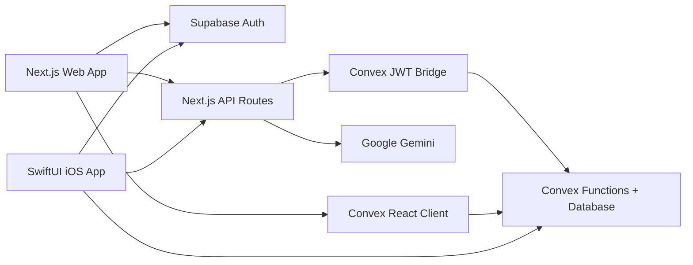

<div align="center">
  

  <h1>SettleEase</h1>

  <p>
    <strong>A polished group expense, settlement, analytics, and reporting app for people who want the math to disappear.</strong>
  </p>

  <p>
    <a href="https://settleease-navy.vercel.app">Production URL</a>
    ·
    <a href="#quick-start">Quick Start</a>
    ·
    <a href="#ios-app">iOS App</a>
    ·
    <a href="#deployment">Deployment</a>
  </p>

  <p>
    
    
    
    
    
    
  </p>
</div>

---

## Final Snapshot

SettleEase is a full-stack expense sharing app built around one goal: make group money simple, auditable, and a little less awkward.

This repository is the final cleaned snapshot of the project. The long-running development history has been trimmed down for one last GitHub push: tests, debug surfaces, stale assistant/tooling folders, local credentials, old previews, unused files, and unused packages were removed. What remains is the app itself, its deployment path, the Lucide icon generation flow, and the native iOS source.

## What It Does

SettleEase tracks shared expenses for a group, supports flexible split logic, calculates who owes whom, explains the settlement picture with AI, and produces clean audit-style reports.

It is designed for real group workflows:

- Add expenses with equal, unequal, or itemwise splits.
- Handle multiple payers, celebration contributions, and settlement exclusions.
- Calculate optimized settlements and preserve manual payment preferences.
- Scan receipts with Gemini, review extracted items, and turn them into expenses.
- Explore group and personal analytics with interactive charts.
- Generate group summaries or personal statements with optional AI label redaction.
- Sync live data through Convex while using Supabase for authentication.
- Run a companion SwiftUI iOS app against the same backend.

## Highlights

| Area | What SettleEase Includes |
| --- | --- |
| Expense entry | Equal, unequal, itemwise, multiple payers, item categories, date selection, validation, and edit flows. |
| Smart Scan | Receipt image compression, Gemini extraction, item review, category matching, and expense creation. |
| Settlements | Net balance calculation, simplified transaction paths, manual settlement overrides, recorded payments, and audit trails. |
| Analytics | Group and personal dashboards for trends, categories, heatmaps, balances, participant rows, velocity, and data quality. |
| AI summaries | Structured Gemini settlement summaries with Convex caching and deterministic dashboard cards. |
| Export reports | Printable/downloadable HTML reports for group summaries and personal statements, with optional AI redaction. |
| Auth and roles | Supabase email/password, Google OAuth, Convex JWT bridge, admin/user access gates, and profile preferences. |
| iOS | SwiftUI shell with core models, backend services, receipt scanning, dashboard, analytics, manage, and settings views. |

## Architecture



### Core Flow

1. Supabase owns user authentication.
2. The web app exchanges the Supabase session for a short-lived Convex JWT.
3. Convex stores app data and serves realtime queries/mutations.
4. API routes call Gemini for summaries, receipt parsing, and report redaction.
5. The iOS app shares the same Supabase, Convex, and web API backend.

## Tech Stack

| Layer | Technology |
| --- | --- |
| Web app | Next.js 16, React 19, TypeScript 6, Tailwind CSS, Radix UI |
| Data and realtime | Convex |
| Auth | Supabase Auth with email/password and Google OAuth |
| AI | Google Gemini via `@google/generative-ai` |
| Charts | Visx primitives |
| Icons | `lucide-react` plus generated searchable Lucide metadata |
| Native app | Swift 6, SwiftUI, Supabase Swift, Convex Swift |
| Deployment | Vercel for web, Convex deploy for backend functions |

## Quick Start

### Prerequisites

- Node.js 20 or newer
- npm
- Convex account/project
- Supabase project
- Google Gemini API key for AI features
- Xcode 26 for the iOS app

### Web App

```bash
git clone <repository-url>
cd settleease

npm install
cp .env.example .env.local
npm run prebuild
npm run dev
```

Open `http://localhost:3000`.

`npm run prebuild` is required on a fresh checkout because Lucide icon metadata is generated locally and intentionally ignored by git.

### Environment

Create `.env.local` from `.env.example` and fill in the values below.

| Variable | Required | Purpose |
| --- | --- | --- |
| `NEXT_PUBLIC_SUPABASE_URL` | Yes | Supabase project URL used by the browser and API routes. |
| `NEXT_PUBLIC_SUPABASE_ANON_KEY` | Yes | Supabase public anon key. |
| `NEXT_PUBLIC_CONVEX_URL` | Yes | Convex deployment URL for the web app. |
| `CONVEX_DEPLOYMENT` | Yes for Convex CLI | Convex deployment identifier. |
| `CONVEX_DEPLOY_KEY` | Production deploy only | Lets Vercel deploy Convex before the production Next build. |
| `CONVEX_JWT_PRIVATE_KEY` | Yes | RS256 private key used by `/api/convex-token`. |
| `CONVEX_JWT_PRIVATE_KEY_BASE64` | Optional | Base64 alternative to `CONVEX_JWT_PRIVATE_KEY`. |
| `GEMINI_API_KEY` | AI features | Enables summaries, receipt scanning, and report redaction. |

New Supabase users are created as `user` profiles by default. Promote trusted users to `admin` in Convex when they should be able to add, edit, settle, export, scan, and manage app data.

## Scripts

| Command | Description |
| --- | --- |
| `npm run dev` | Start the Next.js dev server on port 3000. |
| `npm run prebuild` | Download Lucide icon JSON and generate searchable metadata. |
| `npm run build` | Run the Lucide prebuild and build the production web app. |
| `npm run build:vercel` | Production Vercel build that deploys Convex first when `CONVEX_DEPLOY_KEY` is set. |
| `npm run convex:dev` | Run Convex code generation/development setup once. |
| `npm run convex:deploy` | Deploy Convex functions. |
| `npm run start` | Start the production Next.js server. |
| `npm run lint` | Run ESLint. |
| `npm run typecheck` | Run TypeScript without emitting files. |

There is no test suite in this final snapshot. The project was intentionally cleaned down to app code and production verification commands.

## Feature Tour

### Dashboard

The dashboard shows the current settlement state, recent expenses, settlement summaries, manual override alerts, and AI-assisted settlement explanations. Convex live queries keep the page current across sessions.

### Expense Management

Admins can add and edit expenses with:

- Equal splits across selected people.
- Unequal split amounts.
- Itemwise splits with per-item sharing and per-item categories.
- Multiple payers for a single expense.
- Celebration contributions for treat-style payments.
- Optional exclusion from settlement calculations.

### Smart Scan

Smart Scan turns a receipt image into a reviewable expense draft. The client compresses supported image types, sends them to the scan API, and lets the admin review extracted items, totals, taxes, categories, payers, and split choices before saving.

### Settlements

SettleEase calculates net balances and simplified payment paths, then layers in recorded payments and active manual settlement overrides. This keeps the optimized math available while still supporting real-world preferences like "A should pay B directly."

### Analytics

Analytics supports group and personal modes, date filters, weekly/monthly granularity, trend charts, category breakdowns, activity heatmaps, participant tables, balance timelines, top expenses, and data-quality warnings.

### Export Center

The export flow builds printable reports from the same calculation model used by the app. Reports can be generated for:

- Group summaries
- Personal statements
- Custom date ranges
- Redacted or non-redacted labels

Generated report events are stored in Convex for lightweight audit visibility.

### AI Summaries

Gemini summaries use a structured schema so the UI can render stable summary cards instead of free-form blobs. Convex caches summaries by payload and model fingerprint to avoid repeated generation for unchanged data.

### Settings

Settings keeps the final app focused: profile preferences, theme/font preferences, and export access. Runtime debug and prompt editor surfaces were removed during the final cleanup.

## Data Model

| Convex Table | Purpose |
| --- | --- |
| `userProfiles` | Supabase-linked profile data, role, theme/font preferences, welcome state, and last active view. |
| `people` | Group participants. |
| `categories` | Expense categories with Lucide icon names and rank ordering. |
| `expenses` | Expense records, split method, payers, shares, items, celebration contribution, and settlement exclusion flag. |
| `settlementPayments` | Recorded payments between debtors and creditors. |
| `manualSettlementOverrides` | Admin-defined settlement paths that override or supplement optimized payment flows. |
| `aiPrompts` | Active production AI prompt records used by runtime summary generation. |
| `aiConfigs` | Runtime AI model selection and fallback model order. |
| `aiSummaries` | Cached structured settlement summaries. |
| `aiRedactions` | Cached report label redactions. |
| `reportGenerationEvents` | Export preview, print, download, redaction, and cache-hit events. |

## Project Structure

```text
.
├── convex/                         # Convex schema, functions, auth config, generated client bindings
├── ios/SettleEase/                 # Native SwiftUI app, Swift package, Xcode project, iOS docs
├── public/                         # App icon and bundled fonts
├── scripts/                        # Vercel build and Lucide metadata generation
├── src/app/                        # Next.js app router and API routes
├── src/components/settleease/      # Product features and screens
├── src/components/ui/              # Reusable Radix/shadcn-style primitives
├── src/hooks/                      # Auth, Convex data, profile, theme, toast hooks
└── src/lib/settleease/             # Models, calculations, AI helpers, analytics, export helpers
```

## iOS App

The native app lives in `ios/SettleEase` and is split into three Swift modules:

| Module | Purpose |
| --- | --- |
| `SettleEaseCore` | Portable models, formatting, dashboard helpers, sample data, and settlement math. |
| `SettleEaseServices` | Supabase auth, Convex realtime, Convex token bridge, AI routes, receipt images, and haptics. |
| `SettleEaseApp` | SwiftUI shell, auth, dashboard, analytics, manage, scan, and settings views. |

Create the local iOS secrets file before running the app:

```bash
cd ios/SettleEase
cp XcodeApp/Secrets.xcconfig.example XcodeApp/Secrets.xcconfig
```

Then configure:

- `SETTLEEASE_SUPABASE_URL`
- `SETTLEEASE_SUPABASE_ANON_KEY`
- `SETTLEEASE_CONVEX_URL`
- `SETTLEEASE_WEB_BASE_URL`
- `SETTLEEASE_OAUTH_REDIRECT_URL`

Useful verification command:

```bash
cd ios/SettleEase
swift package describe
```

Full app builds require Xcode rather than CommandLineTools:

```bash
cd ios/SettleEase
xcodebuild -quiet -project SettleEase.xcodeproj -scheme SettleEase -sdk iphonesimulator26.4 -destination 'platform=iOS Simulator,name=iPhone 17,OS=26.4' build
```

## Deployment

### Vercel

The repository includes `vercel.json` with:

```json
{
  "buildCommand": "npm run build:vercel"
}
```

For production builds, set `CONVEX_DEPLOY_KEY` so `scripts/vercel-build.js` can deploy Convex and pass the deployment URL into the Next build. For preview/local Vercel builds, the script skips Convex deploy and runs `npm run build`.

### Convex

Use the Convex CLI after configuring the project:

```bash
npm run convex:dev
npm run convex:deploy
```

### Supabase

Configure Supabase Auth providers and redirect URLs for:

- The web origin, for example `https://settleease-navy.vercel.app`
- Local development, for example `http://localhost:3000`
- The iOS callback URL, `settleease://auth-callback`

## Production Checks

Use these commands before a final push or deploy:

```bash
npm run prebuild
npm run lint
npm run typecheck
npm run build
cd ios/SettleEase && swift package describe
```

Known verification notes for this final snapshot:

- `npm run lint` passes with warnings from generated Convex files and a few existing React hook/image lint warnings.
- `npm run build` may log a Supabase environment warning during prerender if local env vars are missing, but the production build completes when configured.
- The iOS `xcodebuild` command requires a full Xcode install and an iOS simulator SDK matching the command.

## Generated And Local Files

The following are intentionally not committed:

- `.env.local`
- `.convex/`
- `.vercel/`
- `.next/`
- `lucide-icons/`
- `src/lib/lucide-icons-metadata.json`
- `ios/SettleEase/.build/`
- `ios/SettleEase/XcodeApp/Secrets.xcconfig`
- local editor, Xcode, OS, and assistant/tooling state

Run `npm run prebuild` whenever a fresh checkout needs Lucide search metadata.

## Final Note

SettleEase reached its final wrap-up as a working, cleaned, production-oriented snapshot. The repo now carries the parts that matter: the app, the backend, the native iOS source, the build path, and enough documentation for someone to understand and run it without digging through years of leftovers.

Thanks for the ride.
