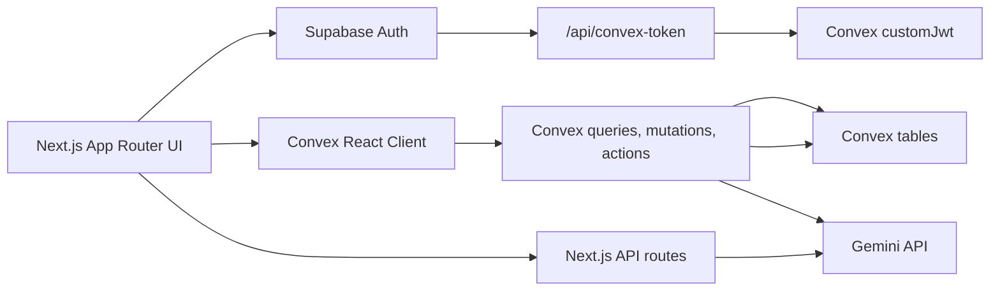

# SettleEase

SettleEase is a full-stack web application for managing shared expenses, settlement payments, receipt scans, analytics, health estimates, and audit-ready reports for a group.

The app is built around a real-time Convex data model, Supabase authentication in production, a local development no-auth mode, and Gemini-powered workflows for receipt parsing, settlement summaries, health estimates, and report redaction.

## Highlights

| Area | What It Does |
| --- | --- |
| Auth Landing | Provides the production sign-in/sign-up landing page with Supabase email/password, Google OAuth, confirmation resend handling, and account-status guidance. |
| Dashboard | Shows the permanent settlement dashboard, outstanding balances, settlement actions, manual override warnings, budget simulation, and transaction history. |
| Expenses | Supports equal, unequal, itemwise, multi-payer, quantity-based, and celebration-contribution splits. |
| Smart Scan | Parses receipt images with Gemini, maps receipt items to categories, and turns reviewed scans into expenses. |
| Settlements | Tracks paid settlements, manual overrides, outstanding payments, and per-person settlement details. |
| Analytics | Provides spending trends, participant balances, category breakdowns, activity views, top expenses, and data-quality warnings. |
| Health | Estimates calories, macros, alcohol servings, and health trends from qualifying food/alcohol expenses. |
| Reports | Generates printable/downloadable group and personal reports with optional AI label redaction and event analytics. |
| Admin Console | Manages environment-safe settings, AI model configuration, maintenance tasks, data counts, seeds, backfills, and danger-zone operations. |
| Shortcuts | Provides app-wide keyboard navigation, shortcut hints, dashboard search focus, and a shortcuts modal. |

## Architecture



Production authentication is handled by Supabase. The browser sends the Supabase session token to `/api/convex-token`, which validates the user with Supabase and returns a short-lived Convex JWT signed with the app's JWT private key. Convex then uses that identity for authorization.

Local development intentionally bypasses Supabase auth. In `NODE_ENV=development`, the app uses plain `ConvexProvider`, a synthetic admin user, and the development Convex deployment.

## Tech Stack

| Layer | Technology |
| --- | --- |
| Framework | Next.js 16 App Router, React 19, TypeScript |
| Data/backend | Convex queries, mutations, actions, schema, file-storage export/import support |
| Auth | Supabase email/password and Google OAuth, bridged into Convex custom JWT auth |
| AI | Google Gemini via `@google/generative-ai` |
| UI | Tailwind CSS, shadcn/Radix primitives, Lucide icons, custom SettleEase components |
| Charts | Custom analytics models with Visx primitives |
| Theming | `next-themes`, Convex-backed user preferences, Inter default typography |
| Deployment | Vercel + Convex deploy flow |

## Core Features

### Dashboard

The dashboard is the primary operating surface. It combines simplified settlement recommendations, pairwise transaction tracing, settlement payment actions, manual override visibility, budget simulation entry points, and the expense activity log.

The dashboard route is:

```text
/?view=dashboard
```

### Expense Management

Admins can add and edit expenses with:

- multiple payers
- equal, unequal, and itemwise split methods
- item-level category labels
- quantity-based item sharing
- celebration contributions
- settlement exclusion for non-settling records
- category-aware Lucide icon rendering

People and categories are managed as first-class data tabs. Categories support custom icons and ordering.

### Smart Receipt Scan

Smart Scan accepts receipt images, sends them to the Gemini receipt parser, and returns structured receipt data:

- restaurant name
- receipt date
- line items
- quantities and unit prices
- taxes, subtotals, additional charges
- category hints

The scan result is reviewed by the admin before becoming a saved expense.

### Settlements

SettleEase calculates settlement balances from expenses, recorded payments, and active manual overrides. Admins can:

- mark recommended payments as paid
- unmark or edit settlement records
- create manual settlement paths
- clear active overrides from the admin console
- inspect relevant expenses behind settlement recommendations

### Analytics

Analytics are built from local model helpers, not ad hoc UI calculations. The analytics model supports:

- group and personal modes
- date presets and custom ranges
- weekly/monthly granularity
- category breakdowns
- paid-vs-share analysis
- balance timelines
- activity heatmaps
- top expenses and participant rows
- data-quality warnings

### Health Estimates

The Health tab uses Gemini-backed ledger estimates for qualifying food and alcohol expenses. It tracks:

- calories
- protein, carbs, and fat
- alcohol servings and alcohol calories
- confidence labels
- category and participant summaries
- cache coverage and generation status

Health estimates are informational and depend on the available expense descriptions/items.

### Reports And Exports

The Export tab builds printable and downloadable HTML reports for group and personal statements. Reports can include:

- settlement summaries
- participant balances
- expense details
- manual override context
- settlement payments
- optional AI label redaction

Report generation events are tracked in Convex for admin analytics, including preview, print, download, redaction generation, redaction cache hit, and fallback events.

### Admin Settings

Settings is an admin-only console with environment-aware controls. It shows:

- admin identity and role
- client/server environment status
- Convex deployment target
- table counts
- AI model and fallback configuration
- report analytics
- maintenance actions
- danger-zone actions with server-side safeguards

If the client environment, Convex URL, and server environment do not match, Settings becomes read-only and mutations are disabled.

## Data Model

Convex is the source of truth for application data.

| Table | Purpose |
| --- | --- |
| `userProfiles` | Supabase user mapping, role, name, theme/font preferences, welcome state, and last active view. |
| `people` | Group participants. |
| `categories` | Expense categories with Lucide icon names and ordering. |
| `expenses` | Shared expense records, split method data, itemwise splits, payers, shares, exclusions, and timestamps. |
| `budgetItems` | Budget catalog entries derived from historical and custom observations. |
| `settlementPayments` | Recorded payments between debtors and creditors. |
| `manualSettlementOverrides` | Admin-defined settlement paths that can override simplified settlement output. |
| `aiPrompts` | Active prompt templates for AI workflows. |
| `aiConfigs` | Active Gemini model and fallback order. |
| `aiSummaries` | Cached settlement and health AI outputs. |
| `aiRedactions` | Cached report label redactions. |
| `reportGenerationEvents` | Report preview, print, download, redaction, and cache analytics. |

## Auth And Authorization

Production and hosted environments use Supabase Auth. Convex authorization is enforced server-side through auth guard helpers:

- unauthenticated Convex calls are rejected unless the development deployment explicitly disables auth
- profile queries/mutations require the requesting user to match the target Supabase user id
- admin mutations require a Convex `userProfiles.role` of `admin`
- destructive admin mutations also require expected environment and confirmation phrase validation

Local development uses a synthetic admin identity:

```text
settleease-development-admin
development@settleease.local
```

This is only intended for local development against the development Convex deployment.

The production auth page is the official SettleEase landing/auth surface. It preserves the full Supabase flow, including email/password sign-in, signup confirmation, Google OAuth, resend confirmation handling, and account-status messaging for Google-backed or unconfirmed accounts.

## Environment Separation

SettleEase is designed so local development and production cannot accidentally target each other.

| Environment | Convex URL | Auth Mode |
| --- | --- | --- |
| Development | `https://shocking-panda-595.convex.cloud` | Local no-auth synthetic admin when `SETTLEEASE_DISABLE_AUTH=true` |
| Production | `https://fortunate-fox-427.convex.cloud` | Supabase session bridged to Convex JWT |

Client and server environments are checked independently:

- client: `NEXT_PUBLIC_SETTLEEASE_ENV`
- Convex server: `SETTLEEASE_ENV`
- Convex auth bypass: `SETTLEEASE_DISABLE_AUTH`
- expected Convex host: derived from the environment

Danger-zone mutations require:

- admin role
- matching `expectedEnvironment`
- exact typed confirmation phrase
- production danger-zone unlock confirmation when targeting production

## Local Development

Install dependencies:

```bash
npm install
```

Create `.env.local` from `.env.example` and use the development Convex deployment:

```bash
NEXT_PUBLIC_SETTLEEASE_ENV=development
NEXT_PUBLIC_CONVEX_URL=https://shocking-panda-595.convex.cloud
CONVEX_DEPLOYMENT=dev:shocking-panda-595
```

Supabase values are not required for local `npm run dev` because local development bypasses auth.

Set the matching Convex environment variables on the development deployment:

```bash
npx convex env set --deployment dev SETTLEEASE_ENV development
npx convex env set --deployment dev SETTLEEASE_DISABLE_AUTH true
```

Start the app:

```bash
npm run dev
```

Open:

```text
http://localhost:3000
```

Deploy current Convex functions/schema to development:

```bash
npm run convex:dev
```

## Production Setup

Production requires Supabase, Convex, Gemini, and JWT signing configuration.

Required public app variables:

```bash
NEXT_PUBLIC_SETTLEEASE_ENV=production
NEXT_PUBLIC_CONVEX_URL=https://fortunate-fox-427.convex.cloud
NEXT_PUBLIC_SUPABASE_URL=...
NEXT_PUBLIC_SUPABASE_ANON_KEY=...
```

Required server variables:

```bash
SUPABASE_SERVICE_ROLE_KEY=...
CONVEX_JWT_PRIVATE_KEY=...
CONVEX_JWT_PUBLIC_KEY=...
CONVEX_JWT_KEY_ID=...
GEMINI_API_KEY=...
```

Required Convex production variables:

```bash
SETTLEEASE_ENV=production
GEMINI_API_KEY=...
```

Production should not set `SETTLEEASE_DISABLE_AUTH=true`.

## AI Configuration

The active AI model configuration is stored in Convex under `aiConfigs`.

Default model:

```text
gemini-3.1-flash-lite-preview
```

Supported fallback models:

```text
gemini-3-flash-preview
gemini-2.5-flash
```

AI model order is used by:

- settlement summary generation
- health ledger estimates
- receipt scanning
- report label redaction
- budget VAT classification

If a model fails, the app attempts configured fallbacks before returning an error.

## Scripts

| Command | Purpose |
| --- | --- |
| `npm run dev` | Starts Next.js on port 3000. |
| `npm run build` | Runs the production Next.js build. |
| `npm run build:vercel` | Production Vercel build with Convex deploy integration; preview builds skip Convex deploy. |
| `npm run start` | Starts the built Next.js app. |
| `npm run lint` | Runs ESLint. |
| `npm run typecheck` | Runs TypeScript without emitting files. |
| `npm run convex:dev` | Deploys Convex functions/schema once to the configured development deployment. |
| `npm run convex:deploy` | Deploys Convex through the Convex CLI. |

The build pipeline downloads/generates Lucide metadata before production builds. Local dev ensures the metadata exists before starting.

## Project Structure

```text
src/app/                  Next.js app shell and API routes
src/components/settleease SettleEase feature tabs and domain components
src/components/ui         Shared shadcn/Radix UI primitives
src/hooks                 Auth, Convex data, theme/font, shortcuts, and health hooks
src/lib/settleease        Domain models, calculations, AI helpers, auth helpers, and utilities
convex/                   Convex schema, queries, mutations, actions, auth config, and guards
scripts/                  Lucide metadata and Vercel build helpers
public/                   Static assets and local fonts
```

## Quality Gates

Before shipping changes, run:

```bash
npm run typecheck
npm run lint
npm run build
```

`next.config.ts` currently allows Next.js builds to continue with TypeScript build errors, so `npm run typecheck` is the authoritative TypeScript gate.

## Deployment Notes

Vercel production deploys use `scripts/vercel-build.js`, which runs Convex deploy with the Next.js build command when `VERCEL_ENV=production`.

Preview/staging Vercel builds intentionally skip Convex deploy. This keeps preview builds from mutating the production Convex deployment.

Use Convex export/import carefully when syncing data between deployments. Development resets and production danger-zone actions are intentionally guarded by environment checks and confirmation phrases.

## Security Notes

- Local no-auth mode is only for local development.
- Production auth is Supabase-backed and Convex-enforced.
- Admin-only routes are protected in the UI and in Convex mutations.
- Destructive actions validate environment and confirmation phrases on the Convex server, not only in the browser.
- Secrets must remain in environment providers and must not be committed.

## License

Private application. All rights reserved.
